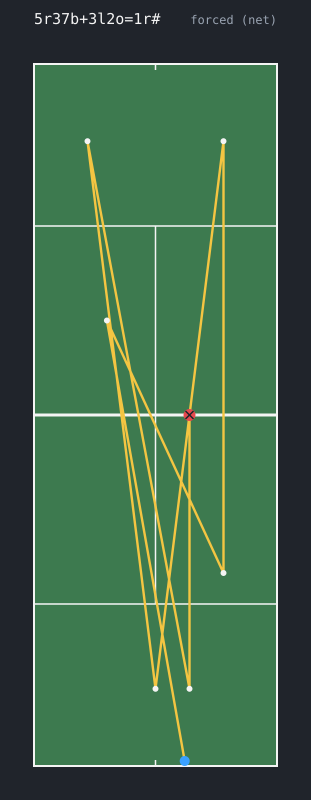

# tcl

messing around with tennis match data.

people chart pro matches shot by shot, and the format everyone uses (the match
charting project, off tennis abstract) is this shorthand where a whole point is
one string:

```
4ffbbf*
```

serve out wide, forehand, forehand, backhand, backhand, forehand winner.

`tcl viz` draws it (rough - the notation only gives loose directions):



more in [docs/examples](docs/examples).

there's thousands of matches typed out like this and basically nothing that reads
it properly - people load it into a spreadsheet or write a one-off script and
move on. so this is me building an actual parser for it, plus some stats on top.
eventually i want it to:

- read a point string into something structured
- read a whole charted match csv and check it's not broken - score doesn't add
  up, players not alternating, impossible shot order
- flag the actual charting mistakes in the data, there's a fair few
- rally length distributions, what a guy does on the ball right after his serve,
  error rate vs how long the rally goes, serve placement on break points
- draw a point - animate the ball around the court

## right now

pretty bare. what's there:

- scoring state machine (`src/scoring/`) - feed it point winners and it tracks
  the score. needed because the shorthand only records who won each point, not
  the score, so to check a match you replay it and see if the final score lines
  up. points, deuce, games, sets, best of 3 and 5, tiebreak with the serve
  rotation
- lexer (`src/lexer/`) - turns a charting string into tokens, flags characters
  it doesn't know and keeps going
- parser (`src/parser/`, `src/ast/`) - hand-written recursive descent, tokens ->
  a tree for one point (serve, rally of shots with direction/depth/position, how
  it ended). partial tree + diagnostics on bad input, doesn't throw. errors
  print with a caret under the bad character:

  ```
    4fQf*
      ^ don't recognize 'Q'
  ```
- viz (`src/viz/`) - `tcl viz "4ffbbf*" -o point.svg` draws the point on a court
  from the parsed shots. schematic, positions are approximate
- `tcl score aabba` (`--tb`, `--bo5`), `tcl lex 4ffbbf*`, `tcl parse 4ffbbf*`,
  `tcl viz 4ffbbf*` - mostly for eyeballing while building
- notes on the notation in `docs/notation.md`

## todo

- [x] scoring: points, deuce, games, sets, best of 3
- [x] scoring: tiebreak
- [x] scoring: serve rotation in the breaker
- [x] scoring: best of 5
- [ ] scoring: the wimbledon final-set rule changes (changed twice)
- [ ] scoring: walk every reachable score, make sure none are impossible
- [ ] write out the notation grammar properly
- [x] tokenizer
- [x] parser -> tree for one point
- [x] error messages that point at the bad character (caret under the offset,
      like a compiler)
- [ ] read a full match csv
- [ ] the checks (alternation, replay the score)
- [ ] flatten to one row per shot
- [ ] stats
- [x] the court drawing (schematic for now, no real coordinates)

## build

need cmake + a c++20 compiler. catch2 gets pulled in for tests.

```
cmake -B build
cmake --build build
ctest --test-dir build
```

## data

the match charting data isn't mine - it's jeff sackmann / tennis abstract
(CC BY-NC-SA). i don't check it in, `scripts/fetch_mcp_data.sh` grabs it. the
notation writeup in `docs/` is my own, from their guide.
