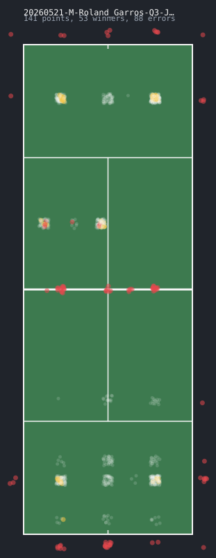

# examples

svgs made with `tcl viz "<string>" -o <file>.svg` and `tcl matchviz <file.csv>
-o <file>.svg`. positions are approximate - the notation only gives rough shot
direction/depth - so it's for a feel of the point(s), not a real plot. blue dot
= serve contact, gold = winner, red x/dot = error.

## single points

| point | |
|---|---|
| `4ffbbf*` forehand winner |  |
| `5r37b+3l2o=1r#` long rally, forced error into the net |  |
| `6f8b1f3f*` serve down the T, a couple grounds, winner |  |
| `4bfn@` unforced error into the net |  |

## a whole match

`match-shot-chart.svg` - every shot from a real charted match (141 points,
[JeffSackmann/tennis_MatchChartingProject](https://github.com/JeffSackmann/tennis_MatchChartingProject),
CC BY-NC-SA), all plotted translucent on one court with `tcl matchviz`. each
dot is jittered a little (deterministically, same file always draws the same
picture) so hundreds of shots landing in the same ~9 rough zones per side
don't just stack into a rigid grid.

