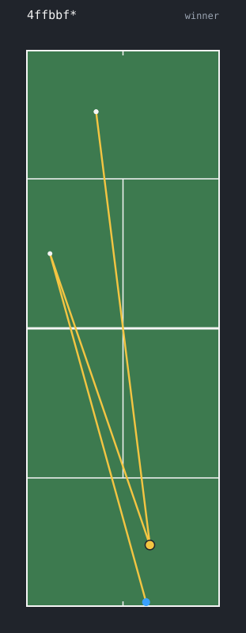
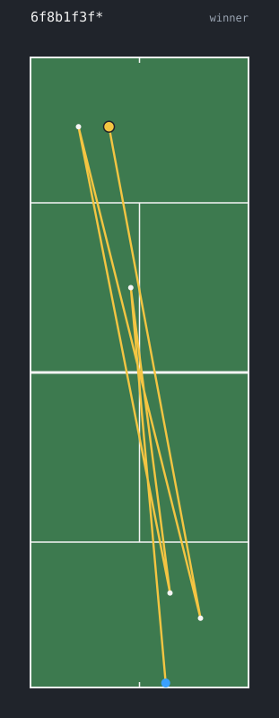
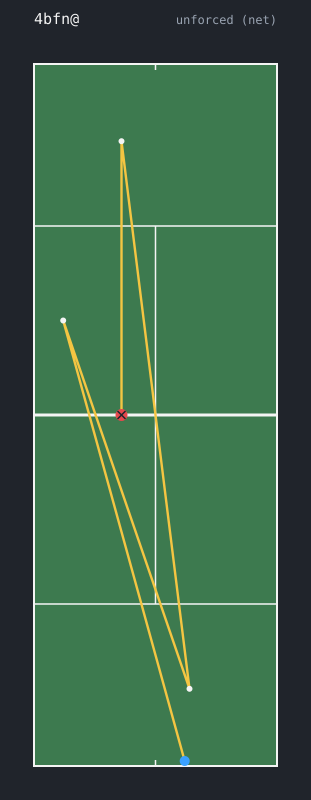

# examples

svgs made with `tcl viz "<string>" -o <file>.svg`. positions are approximate -
the notation only gives rough shot direction/depth - so it's for a feel of the
point, not a real plot. blue dot = serve contact, gold = winner, red x = error.

| point | |
|---|---|
| `4ffbbf*` forehand winner |  |
| `5r37b+3l2o=1r#` long rally, forced error into the net |  |
| `6f8b1f3f*` serve down the T, a couple grounds, winner |  |
| `4bf@n` unforced error into the net |  |
